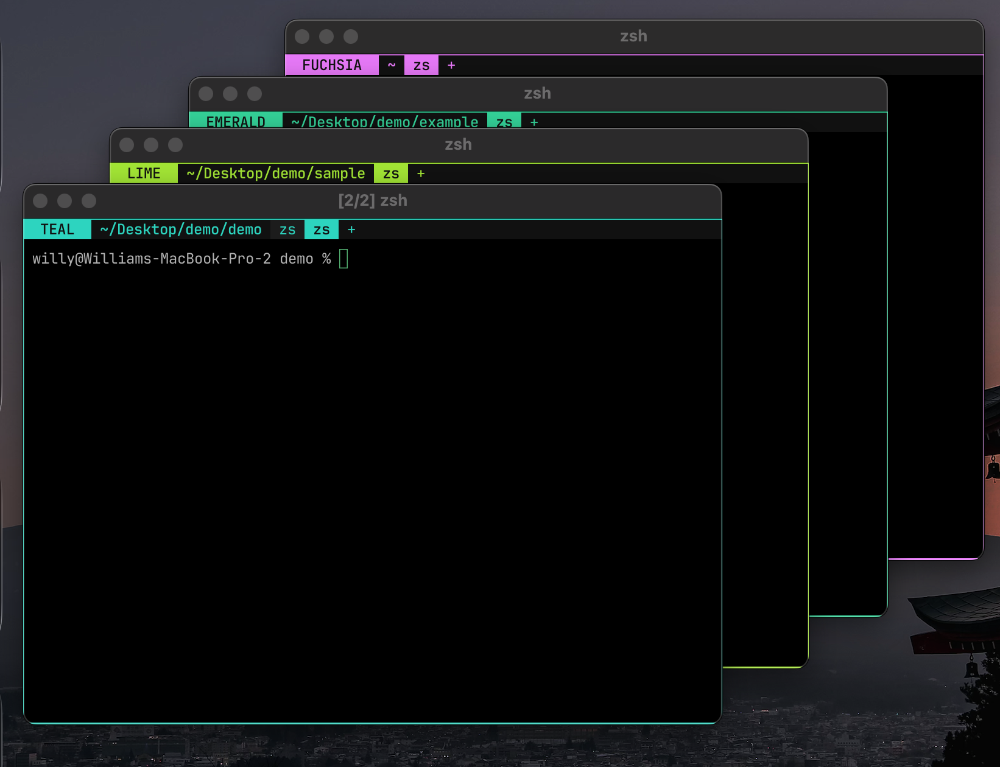

# WezTerm Window Tint

Project-aware window tinting for [WezTerm](https://wezterm.org/).

WezTerm Window Tint colors your terminal window based on the project in the
active tab or pane. Open several terminals across several repositories and the
active project gets an immediate, subtle visual identity.

It is a WezTerm Lua plugin. Require it from `wezterm.lua`, configure the
options you want, and reload.



## Features

- Project colors based on the active pane's git root.
- Automatic fallback to cwd for non-git folders.
- Runtime-scoped colors from a curated 12-color palette.
- Collision avoidance for the first 12 distinct projects.
- Retinting when you switch tabs or panes.
- Live `cd` retinting when WezTerm receives cwd updates.
- Subtle frame, tab bar, active tab, and optional status badge tinting.

Colors intentionally reshuffle after restarting WezTerm. The goal is quick
session identity, not permanent project branding.

## Install

### Native WezTerm Plugin

Add this to `~/.config/wezterm/wezterm.lua`:

```lua
local wezterm = require 'wezterm'
local config = wezterm.config_builder()

local window_tint = wezterm.plugin.require('https://github.com/willytop8/Wezterm-Window-Tint')

window_tint.apply_to_config(config, {
  show_badge = true,
  set_retro_tab_bar = true,
})

return config
```

If you already have a `wezterm.lua`, keep your existing config and add only the
`wezterm.plugin.require(...)` and `window_tint.apply_to_config(config, ...)`
lines before `return config`.

Reload WezTerm with `Cmd+Shift+R` on macOS, or quit and reopen it.

To update later:

```lua
wezterm.plugin.update_all()
```

Remove that line after WezTerm has updated the plugin.

### npm / npx Installer

The native WezTerm plugin loader above is the recommended install path. If you
prefer npm, this package also includes a small installer that copies the Lua
module into your WezTerm config directory:

```sh
npx @willytop8/wezterm-window-tint install
```

Then add this to `~/.config/wezterm/wezterm.lua` before `return config`:

```lua
require('wezterm-window-tint').apply_to_config(config, {
  show_badge = true,
  set_retro_tab_bar = true,
})
```

Installer options:

```sh
npx @willytop8/wezterm-window-tint install --dry-run
npx @willytop8/wezterm-window-tint install --force
npx @willytop8/wezterm-window-tint install --config-dir ~/.config/wezterm
```

### Manual Install

If you prefer not to use WezTerm's plugin loader, copy the module into your
config directory:

```sh
mkdir -p ~/.config/wezterm
cp wezterm-window-tint.lua ~/.config/wezterm/wezterm-window-tint.lua
```

Then require it from `wezterm.lua`:

```lua
require('wezterm-window-tint').apply_to_config(config, {
  show_badge = true,
  set_retro_tab_bar = true,
})
```

## Options

```lua
window_tint.apply_to_config(config, {
  show_badge = true,
  set_retro_tab_bar = true,
  retint_interval_seconds = 1,
  palette = {
    { name = 'rose', hex = '#fb7185' },
    { name = 'orange', hex = '#fb923c' },
    { name = 'amber', hex = '#fbbf24' },
  },
})
```

- `show_badge`: show a left status badge with the color name and project path.
- `set_retro_tab_bar`: set `use_fancy_tab_bar = false` for reliable tab tinting.
- `retint_interval_seconds`: status update interval used to refresh the active
  pane's cwd.
- `palette`: optional list of `{ name, hex }` entries.

## Live `cd` Retinting

WezTerm can track cwd through shell integration and OSC 7. If changing
directories does not retint the window, add this to `~/.zshrc`:

```zsh
_osc7_cwd() {
  printf '\e]7;file://%s%s\e\\' "${HOST:-localhost}" "$PWD"
}
autoload -Uz add-zsh-hook
add-zsh-hook chpwd _osc7_cwd
add-zsh-hook precmd _osc7_cwd
```

Then restart your shell.

## Notes

Colors are assigned for the current WezTerm runtime and reshuffle after
restart. If your config already customizes tab titles, window frames, or tab bar
colors, merge those settings with this module's handlers and overrides.

## Credits

This was built as a WezTerm replacement for
[Hyper-WindowTint](https://github.com/willytop8/Hyper-WindowTint).

## License

MIT
